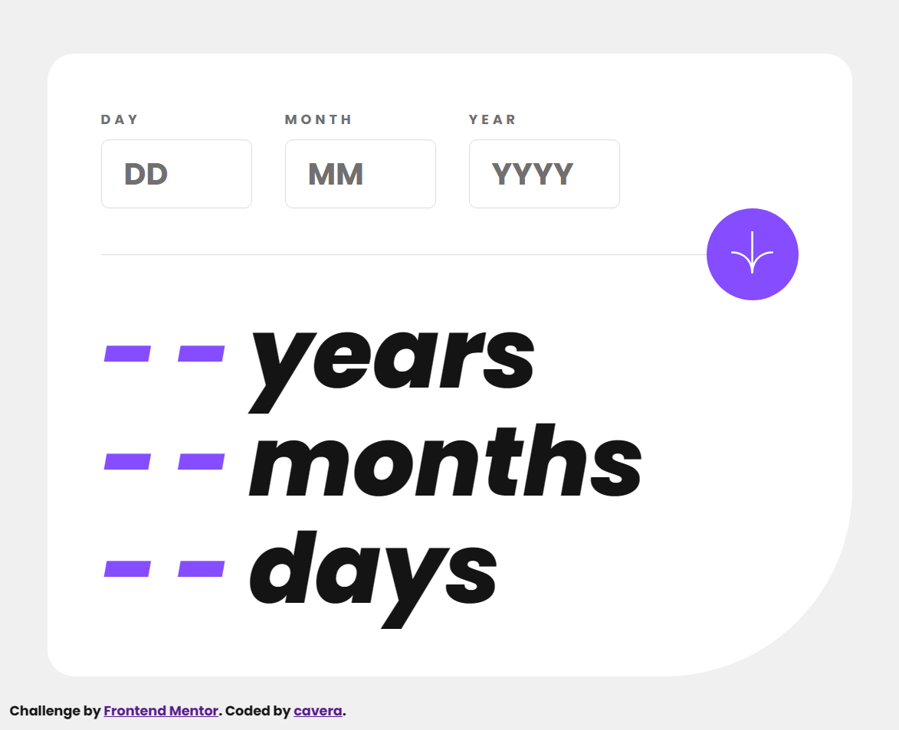

# Frontend Mentor - Age calculator app solution

This is a solution to the [Age calculator app challenge on Frontend Mentor](https://www.frontendmentor.io/challenges/age-calculator-app-dF9DFFpj-Q). Frontend Mentor challenges help you improve your coding skills by building realistic projects. 

## Table of contents

- [Overview](#overview)
  - [Screenshot](#screenshot)
  - [Links](#links)
- [My process](#my-process)
  - [Built with](#built-with)
  - [What I learned](#what-i-learned)
- [Author](#author)

## Overview

### Screenshot



### Links

- Solution URL: [github.com/cavera/age-calculator-app](https://github.com/cavera/age-calculator-app)
- Live Site URL: [fe-mentor-agecalc.netlify.app](https://fe-mentor-agecalc.netlify.app/)

## My process

### Built with

- Semantic HTML5 markup
- CSS custom properties
- Flexbox
- CSS Grid
- Mobile-first workflow
- [React](https://reactjs.org/) - JS library
- [Vite.js](hhttps://vitejs.dev/) - Bundler
- [SASS](https://sass-lang.com/) - For styles
- [GSAP](https://greensock.com/gsap/) - For animation

### What I learned

I tried to separate the logic into a separate file as custom hooks that make the calculation and determine the maximum possible value of the inputs.
```js
const { mytime: { days, months, years } } = useDateCalc(birthday)
```
```js
const { inputState, inputStates, inputChange, updateInput } = useDateInput(
    inputRef,
    id
  )
```
Another thing I learned is the implementation of React Context and custom hooks to make the code cleaner and fulfill all the requirements of the challenge.

I tried to make the responsive design more dependent on CSS variables rather than having to repeat classes or tags.

```SCSS
@media (min-width:$bkp-desktop) {
	:root{
		--space: 28px;
		--btn-size: 96px;
		--max-width: 840px;
		--padding-h:calc(var(--space) * 2);

		--fz-label:14px;
		--fz-input:32px;
		--fz-input-text:10px;

		--input-w:158px;
		--input-h:72px;

		--fz-result:102px;
	}
}
```
It's the first time I've used GSAP with React. There is a lot to learn about it, and there are a lot of options to animate elements, but I wanted to use it because I have experience with it in Vanilla JS.

## Author

- Website - [Github](https://github.com/cavera)
- Frontend Mentor - [@cavera](https://www.frontendmentor.io/profile/cavera)
- Twitter - [@cavera_de](https://twitter.com/cavera_de)